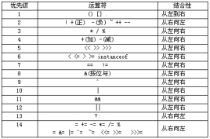

# Notes

记录编译器各部分的大致原理

## 1. 项目内容

语法制导的翻译器、中间代码解释器GUI

1. 编译器部分
   1. 词法分析
   2. 语法分析
   3. 语义分析
   4. 中间代码生成
2. 解释器部分
   1. 执行中间代码
3. GUI部分

## 2. 原理及标准

### 2.1. 编译器

#### 2.1.1. 词法分析

~~通过正则表达式规定词法，然后处理成最小DFA的状态转移表~~

~~处理流程为：~~  
~~正则表达式 -> NFA -> DFA -> 最小DFA~~

通过代码直接从文件读出一个单词。  

- 保留字:int、if、then、else、while、do。
- 标识符:用助记符(或称为单词记号) ID 表示。
- 常数: 用助记符 NUM 表示。
- 算术运算符:+、- 、*、/。
- 逻辑运算符:and、or。
- 关系运算符:<、>、<=、>=、!= 、== 用助记符relop 表示。
- 分隔符:{、}、 ;、(、 )、=。

关键词在`language.txt`中，格式为：

```text
define keywords
<标识符1> 关键字1
<标识符2> 关键字2
```

功能相似的关键字应使用相同的标识符，如`+`和`-`  
这里`<op4>`的数字为c语言运算符优先级对应数字*待定，根据语法分析方式*  


如：

```test
define keywords
<type_name> int
<if> if
<else> else
<while> while
<op4> +
<op4> -
<op3> *
<op3> /
<op1(> (
<op1)> )
<;> ;
```

#### 2.1.2. 语法分析

~~通过LL(1)文法描述文法，计算得到LL(1)分析表~~  
~~处理流程为：~~  
~~LL(1)文法 -> First集、Follow集 -> Select集 -> LL(1)分析表 -> 语法树~~

使用递归子程序，代码中直接实现对不同语句翻译，但是使用类似的架构。
语法分析以word为元素，每次调用词法分析获得一个单词，应该在词法分析开始前添加keyword的定义。
句子的定义见language文档。

表达式`expression`除外，递归子程序不能简单的处理表达式内部的优先关系，尤其是从左到右的运算。  
这里使用栈的方式读入并处理表达式，并输出合适的中间代码。

经过递归子程序中子程序的抽象，子程序间可以不传递信息，只有调用关系。  
对于`if`等分支，通过`line_number`获得需要跳到的地方。

#### 2.1.3. 语义分析

语义分析在语法分析的同时进行，对语义进行静态检查

#### 2.1.4. 中间代码生成

中间代码使用三地址码（四元组）。*待定*

### 2.2. 解释器

### 2.3. GUI

编译器参数(后端python调用)  
`./compiler.exe -f <input> [-s]`  
-f 指定输入文件  
*-s 显示全部输出（可选，不加则只显示可能的报错）  
中间代码输出到./middle.txt (运行结果？)  
样例调用：`./compiler.exe -f input.txt -s`
